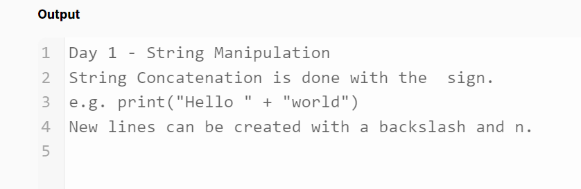

# Day1 Project: Band Name Generator
Instructions:
1. Create a greeting for your program.

2. Ask the user for the city that they grew up in.

3. Ask the user for the name of a pet.

4. Combine the name of their city and pet and show them their band name.

5. Make sure the input cursor shows on a new line:

Day1-Task1
Instructions:
Write a program in main.py that prints the following notes on Python programming into the Output console. Your code should print all three lines.
Day 1 - Python Print Function
The function is declared like this:
print('what to print')

Day1-Task2
Instructions
Look at the code in the code editor on the left. There are errors on all 4 lines of code. Fix the code so that it runs without errors.

Day1-Task3
Instructions:
Write a program that calculates and outputs the number of characters in any name. The automated tests will try out lots of different names as the input. Your code should work for any name.

Day1-Task4
Instructions:
This program takes two inputs. The first input is stored in a variable called a. The second input is stored in a variable called b.

Write a program that switches the values stored in the variables a and b.

Example Input 1
29
41
Example Output 1
a: 41
b: 29