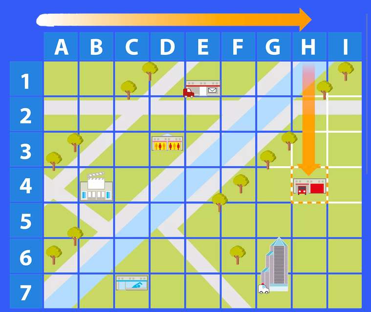
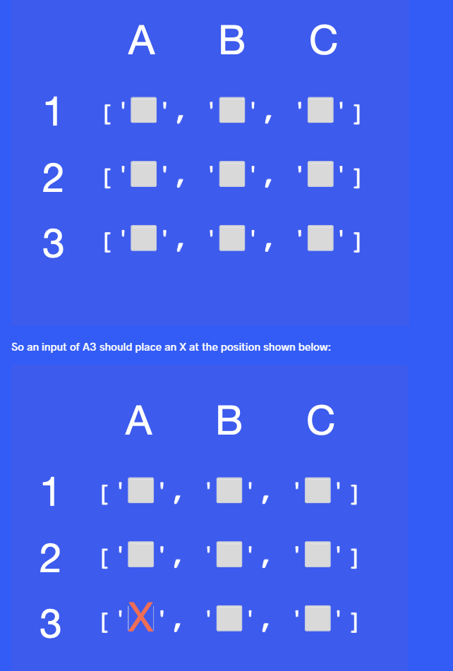

# Day4 Project: Rock Paper Scissors

## Day4-Task1
Instructions:
You are going to write a virtual coin toss program. It will randomly tell the user "Heads" or "Tails".

Important, the first letter should be capitalised and spelt exactly like in the example e.g. "Heads", not "heads".

There are many ways of doing this. But to practice what we learnt in the last lesson, you should generate a random number, either 0 or 1. Then use that number to print out "Heads" or "Tails".

e.g. 1 means Heads 0 means Tails

Example Output
Heads
or

Tails

## Day4-Task2
Instructions:
You are going to write a program that will select a random name from a list of names. The person selected will have to pay for everybody's food bill.

Important: You are not allowed to use the choice() function.

Line 1 splits the string names_string into individual names and puts them inside a List called names. For this to work, you must enter all the names as names followed by comma then space. e.g. name, name, name

NOTE: Don't worry about getting hold of the input(), we've done the work behind the scenes to import everything.

HINT: Assume that names looks like this: input: x, y, z, names = ["x", "y", "z"]

Example Input
Angela, Ben, Jenny, Michael, Chloe
Note: notice that there is a space between the comma and the next name.

Example Output
Michael is going to buy the meal today!

## Day4-Task3
Instructions
This is a difficult challenge. 💪

You are going to write a program that will mark a spot on a map with an X.

In the starting code, you will find a variable called map.

This map contains a nested list. When map is printed this is what it looks like, notice the nesting:

[['⬜️', '⬜️', '⬜️'],['⬜️', '⬜️', '⬜️'],['⬜️', '⬜️', '⬜️']]

This is a bit hard to work with. So on lines 6 and 23, we've used this line of code print(f"{row1}\n{row2}\n{row3}") to format the 3 lists to be printed as a 3 by 3 grid, each on a new line.

['⬜️', '⬜️', '⬜️']

['⬜️', '⬜️', '⬜️']

['⬜️', '⬜️', '⬜️']
Now it looks a bit more like the coordinates of a real map:

Your job is to write a program that allows you to mark a square on the map using a letter-number system.

First, your program must take the user input and convert it to a usable format.

Next, you need to use that input to update your nested list with an "X". Remember that your nested list map actually looks like this:

[['⬜️', '⬜️', '⬜️'],['⬜️', '⬜️', '⬜️'],['⬜️', '⬜️', '⬜️']]
Example Input 1
B3
Example Output 1
Hiding your treasure! X marks the spot.
['⬜️', '️⬜️', '️⬜️']
['⬜️', '⬜️', '️⬜️']
['⬜️️', 'X', '⬜️️']